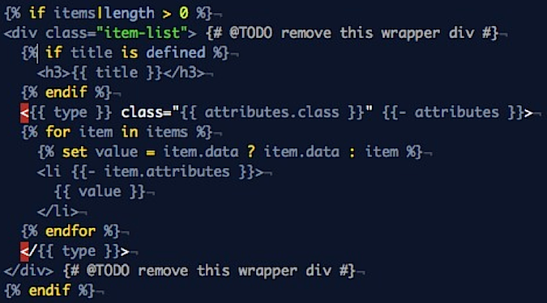

A new theming engine, [Twig](https://twig.symfony.com/), is coming along with
[Drupal](/tags/drupal) 8's adoption of the Symfony framework. And it's downright
magical.

Instead of having theme functions that have to be overridden, everything becomes
an (easy to read, easy to modify) template. Instead of having to figure out
render arrays, themers can use consistent template variables. And instead of
having insecure output, Twig sanitizes everything by default.

If you've ever worked on a [WordPress](/tags/wordpress) or Tumblr theme, the
approach will feel pretty similar. Here's what it looks like:

And oh by the way, [it's well-documented](https://twig.symfony.com/doc/) -- no
small point in the Drupal community!

**Sound too good to be true?** Well, it almost might be, because
[a lot has to happen in order to get this into Drupal 8](https://groups.drupal.org/node/298298).
There's a
[Twig-focused sprint happening right after Drupalcon](https://portland2013.drupal.org/program/sprints.html),
so if you think this is great, come pitch in! Because if things don't get done,
Twig will be held until Drupal 9. No Drupal themer, veteran or newbie, kitten or
human, wants that to happen.

I spoke to **Jen Lampton** (with a contribution from **Fabian Franz**) about how
Twig will result in happier veteran Drupal themers, happier new Drupal themers,
and happier Drupal kittens. Be sure to show up for their
[**featured Drupalcon session (along with Drupal CSS innovator John Albin Wilkins), "Using Twig: The new template engine in Drupal 8," on Wednesday at 3:45 PM.**](https://portland2013.drupal.org/session/using-twig-new-template-engine-drupal-8.html)

---

**IB: What's one thing you're most excited about with Twig?**

JL: Replacing the template engine with something completely different means that
we get to take a good hard look at absolutely everything in the current theme
system, so we can do a clean sweep.

FF: What I love the most about Twig is the syntax, and how it cleverly makes it
possible to [lazy-render things](https://www.drupal.org/node/1982024). The
possibilities of having an interpreted language are endless.

**IB: Can theme developers start converting/creating their themes now?**

JL: No! If you have the time to start converting your own themes, then please,
please, please use the time to help us make the theme system what you want it to
be -- instead. There will be time to convert your themes later, but Drupal
itself can only be monumentally improved _right now_.

**IB: Will frontend developers and themers coming from other CMSes -- like
WordPress -- find Twig easier to use?**

JL: Yes. Front end developers coming from everywhere will find Twig easier to
use. For starters, Twig looks a lot more like HTML, so if you don't know PHP
you'll still be right at home. For people who do know PHP and don't know Twig,
there will be a learning curve, but it's far far FAR less steep than learning
about what Drupal had done to PHPTemplate.

**IB: Twig sounds great! What can people do to help make sure it happens for
Drupal 8?**

JL: There are four main areas where we need help right now, as outlined in our
[Twig TODO wiki](https://groups.drupal.org/node/278968).

1. Help us test all the patches.
2. Help us fix issues with the patches.
3. Help us improve the markup in core (after being converted to Twig).
4. Help us clean up the rest of the theme system.

If people are interested in any one of these four areas, they can
[come to the sprint immediately following DrupalCon](https://portland2013.drupal.org/program/sprints.html)
and get some hands-on help making Drupal better. We need all the hands we can
get since we are up against some major deadlines, so please please please come
help us!
